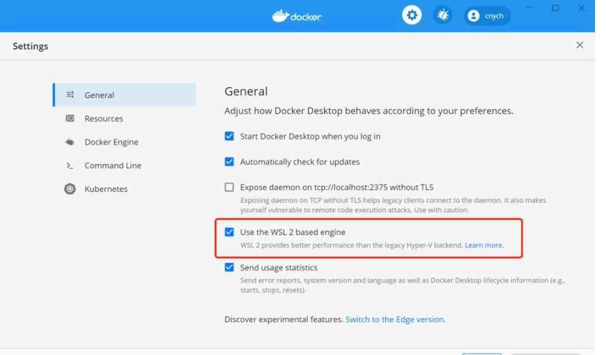
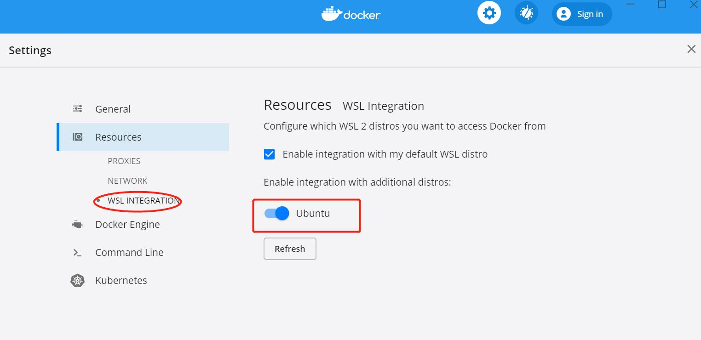

# WSL2 安装 docker 的两种方式


## 1. 前言
Windows10 已经推出了 `WSL2`，相比于 `WSL` 采用的 `API` 转换的方式，`WSL2` 则完全不同，Windows10 开始内置了一个轻量级的虚拟机，记过为软件的不断优化，这个虚拟机已经和 Windows10 高度集成，实现了虚拟机的高性能运行，`WSL2` 便是运行在虚拟机上的一个完整的 Linux 内核，因此 `WSL2` 的使用体验更加贴近原生 Linux，同时 `WSL2` 开启速度有了明显的提升。

## 2. 开启 WSL2 
🤪 自行百度...
```shell
// 查看wsl版本
wsl -l -v
```

## 3. 安装docker的两种方式
### 3.1 原生Linux安装docker
`WSL2` 已经完整使用了 Linux 内核，该种安装方式和在 Linux 虚拟机上安装 docker 相似，步骤如下：

```shell
curl -fsSL https://get.docker.com -o get-docker.sh
sudo sh get-docker.sh
sudo service docker start
```
执行上面的脚本的过程中，，脚本提示 **“建议使用Docker Desktop for windows”**，20s内按  `Ctrl+C` 会退出安装，所以需要等待 20s，另外此种方式需要访问外网。
检查 docker 是否正常安装：

```shell
# 检查 docker 进程是否启动
service docker status
ps aux | grep docker
# 检查拉取镜像功能是否正常
docker pull busybox
docker images
```

**💩 注意：** 不同于完全 Linux 虚拟机方式，`WLS2` 下通过 `apt install docker-ce` 命令安装的 docker 无法启动，因为 `WSL2` 方式的 ubuntu 里面没有 `systemd`。上述官方`get-docker.sh` 安装的 docker，`dockerd` 进程是用 ubuntu 传统的 `init` 方式而非 `systemd` 启动的。

### 3.2 Dcoker Desktop for Windows 的方式
Docker 也专门开发了可以使用 `WSL2` 中的 Docker 守护进程的桌面管理程序, 打开 Docker Desktop WSL2 backend 页面，下载最新的 Docker Desktop for Windows 程序 ，建议下载stable 版本。下载地址：https://www.docker.com/products/docker-desktop



## 4. 总结
- `WSL2` 下原生 Linux 安装 docker 方式和完全 Linux 虚拟机安装 docker 类似，区别在于 `WSL2` 下的 Linux 不支持 `systemd` (垃圾微软，小声BB)。
- Docker Desktop for windows 方式，其实质是利用 docker 的 `C/S` 架构，将 Windows 模式下的 docker 对应 `docker.sock`，docker 客户端二进制和 docker 的数据目录挂载到 `WSL2` 里面的 Linux 机器，在此 Linux 机器下执行 docker 命令(docker 命令为 docker 客户端)，实质为客户端通过挂载的 `/var/run/docker.sock` 文件与 Windows 里面的 `dockerd` 服务端进程通信。