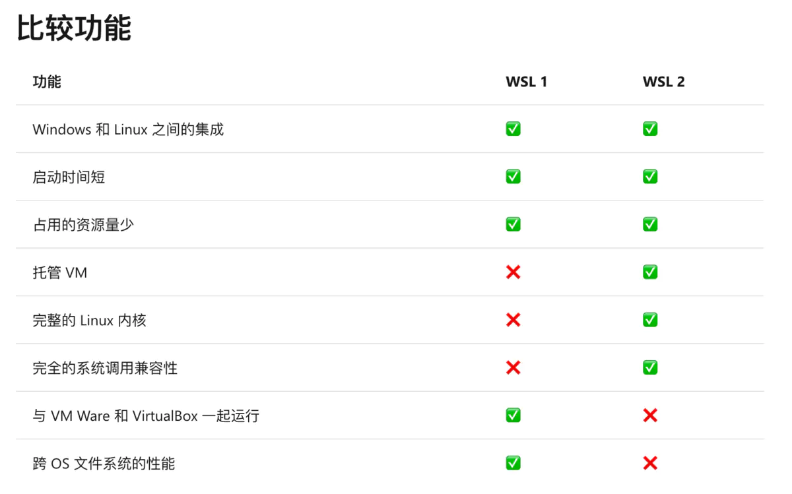

# WSL2数据迁移


> WSL ( Windows Subsystem Linux ) Windows Linux 子系统是 Win10 新增的一个功能，使用 WSL 可以直接在 Windows 上面使用和运行 Linux 程序和命令。而 WSL2 是 WSL 的一个新的版本，自 Windows10 2004 版本发布之后，WSL2 可以直接在 Windows10 中直接使用，相比于 WSL，WSL2 使用了 HyperV 技术，解决了 WSL 不能使用 docker 的问题，性能也得到了进一步的提升，WSL2 也可以说是使用真正的、更加完整的 Linux 内核。



回到正题，开启和安装 WSL2 默认是安装在 C 盘中，随着软件的安装和实际项目的开发，很快就能使 C 盘存储空间告急，所以一个解决办法就是将 WSL2 数据进行迁移，将 WSL2 安装在 C 盘之外的大容量存储位置。当然 C 盘足够大的话，可以直接忽略数据迁移工作。

### 软链接的方式
通过软链接的方式修改 `VHDX` 文件的存放磁盘，达到缓解 C 盘存储压力的问题。

实现方式：

```shell
$newLocation = "E:\WSL\Ubuntu-WSL2\"

cd ~\AppData\Local\Packages\CanonicalGroupLimited.Ubuntu20.04onWindows_79rhkp1fndgsc\LocalState
wsl --shutdown

Optimize-VHD .\ext4.vhdx -Mode Full
mkdir $newLocation -Force
mv ext4.vhdx $newLocation
cd ..
rm LocalState
New-Item -ItemType SymbolicLink -Path "LocalState" -Target $newLocation
```

### 文件导出方式
首先先关闭 WSL

```shell
wsl --shutdown
```

查看系统信息：

```shell
wsl -l -v
```

导出系统文件：

```shell
wsl --export <DistroName> <PathToTarArchive>
```

删除系统：

```shell
wsl --unregister <DistroName>
```

从指定位置导入新的系统：

```shell
wsl --import <DistronName> <PathToTarArchive>
```

设置默认用户：

```shell
ubuntu2004.exe config --default-user xxx
```